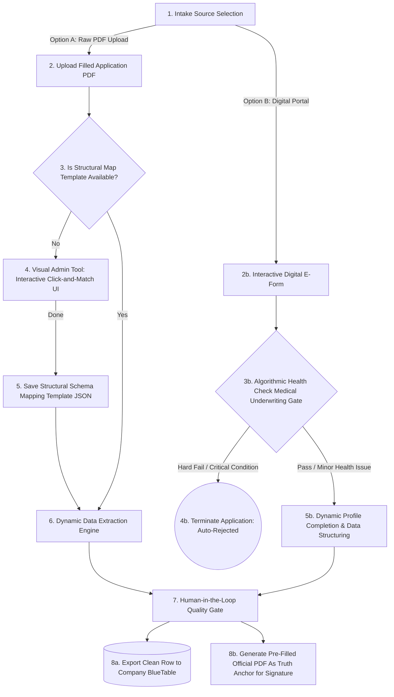

# **🗺️ Project Application-to-BlueTable: Unified Intake Workflow**

⚠️ **POC Status Notice:** This current state of the project is working for a Proof of Concept (POC) and will turn into a production-ready codebase when everything is clear.

This stateless, database-free administrative automation utility eliminates manual data entry, human transcription errors, and cognitive fatigue for insurance operations teams. It provides a visual mapping interface to align multi-page scanned or filled PDFs to a standardized corporate tracking layout ("BlueTable") and caches layouts locally as structured JSON profiles.

## **🔄 System Flow & Operational Method**

The architecture uses a unified, dual-pathway ingestion model designed to absorb legacy paperwork (Pathway A) while guiding customers toward error-free upfront digital data capture (Pathway B). Both pathways converge on a single **Human-in-the-Loop (HITL)** verification layer.

### **End-to-End Pipeline**



### **Detailed Method Breakdown**

#### **1. Pathway A: Legacy PDF Structural Layout Mapping**

When an operator uploads an OriginalApplication.pdf file:

* **Identification:** The file trailer is scanned to extract its cryptographic permanent file identifier (/ID).
* **Cache Match:** If the /ID exists in the local template registry cache (`pdf_registry.json`), coordinate bounding boxes align automatically.
* **Fallback Matrix:** If the template is unknown, the interactive admin canvas initializes. An administrator visually maps the coordinates on the page by drawing bounding boxes to associate physical points directly to BlueTable target fields.

#### **2. Pathway B: Native Digital E-Form**

To restrict human errors upfront, the digital e-form establishes strict input controls:

* **The UI Shield:** Dropdowns, calendar pickers, and strict input masks prevent messy hand-drawn annotations or incorrect strings.
* **Underwriting Triage Gate:** A health questionnaire evaluates the applicant's responses against compliance rules in real-time. Auto-declining chronic conditions immediately halt risk propagation before data reaches internal systems.

#### **3. Convergence & Human-in-the-Loop (HITL) Gate**

Data from both pipelines converges on the administrator's unified split-screen verification interface. The operator confirms, adjusts, and approves the extracted values before final delivery.

## **🚀 Getting Started & Execution**

The project utilizes modern, isolated toolchains to ensure immediate execution with zero global environment contamination.

### **Option 1: Using Nix Flake**

If you use Nix, enter the development environment shell and synchronize dependencies:

```bash
nix develop
uv sync
```

### **Option 2: Using Standard Native UV**

If you have uv installed locally on your system, simply sync your environment:

```bash
uv sync
```

## **🏃 Running the Application & Tests**

Once your dependencies are synchronized through Nix or native UV, use the following commands to execute:

### **Launch the Streamlit Interface**

```bash
uv run streamlit run app.py
```

### **Run Automated Integration Tests**

```bash
uv run pytest
```

## **📂 Layout Configuration Mapping (JSON Schema)**

When layout mappings are completed, layout geometries are registered inside `pdf_registry.json` indexed by their cryptographic PDF /ID key:

### `pdf_registry.json`
Stores extracted PDF structure: page dimensions, field coordinates/widgets, and structural metadata per PDF.

```json
{
  "<pdf_id>": {
    "pages": [
      { "page_num": 1, "page_w": 595.28, "page_h": 841.89 }
    ],
    "fields": [
      {
        "field_kind": "text",
        "name": "Text2",
        "page": 1,
        "coords": {
          "x0": 77.24, "y0": 654.03, "x1": 322.69, "y1": 668.43,
          "width": 245.45, "height": 14.4,
          "canvas_top": 173.46, "canvas_bottom": 187.86
        }
      },
      {
        "field_kind": "radio",
        "name": "Group7",
        "page": 3,
        "states": [],
        "widgets": [
          { "page": 3, "coords": { "x0": 494.37, "y0": 654.54, "x1": 506.5, "y1": 667.06, "width": 12.12, "height": 12.52, "canvas_top": 174.83, "canvas_bottom": 187.35 } }
        ]
      }
    ],
    "structural_hash": "824ce5954797d42838c79ad7cb5c7e0ede088fe13227ff03db748f399335bf24",
    "word_anchors": ["...", "Individual Health and Accident Application Form", "..."]
  }
}
```

### `extracted_values.json`
Maps each PDF field name to its semantic key (used to populate field values from a normalized data model).

```json
{
  "Text2": "name",
  "Text3": "dobd",
  "Text4": "dobm",
  "Text5": "doby",
  "CHPLAN 01": "/Choice2",
  "Check Box2": "/Yes",
  "Group7": "/Choice2"
}
```

### `assignment_cache.json`
Caches the field-to-category assignment per PDF (`<pdf_id>` → field name → category, or `"SKIPPED"` if unused).

```json
{
  "<pdf_id>": {
    "Text2": "name",
    "Text3": "dob",
    "Text6": "SKIPPED",
    "CHPLAN 01": "plan",
    "Text19": "premium",
    "Text23": "sp_name"
  }
}
```
