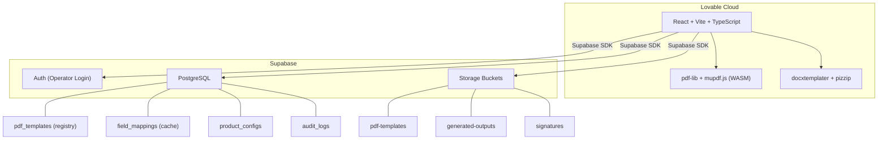
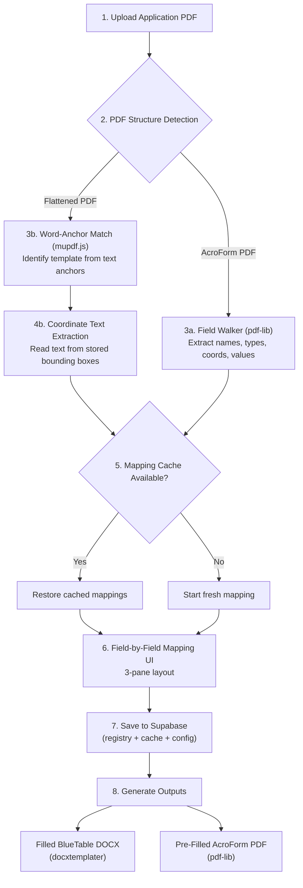

# 🗺️ Application-to-BlueTable: Unified Intake Workflow

> **Lovable-Native Edition** — React + Vite + TypeScript, in-browser PDF processing, Supabase backend.

A stateless administrative automation utility that eliminates manual data entry, human transcription errors, and cognitive fatigue for insurance operations teams. Operators upload scanned or filled PDFs and visually map fields to a standardized corporate tracking layout ("BlueTable"), with layouts cached as structured profiles in Supabase.

## 🏗️ Architecture


```mermaid
graph TD
    subgraph Lovable["Lovable Cloud"]
        App["React + Vite + TypeScript"]
        App --> PDFEngine["pdf-lib + mupdf.js (WASM)"]
        App --> DOCXEngine["docxtemplater + pizzip"]
    end

    subgraph Supabase["Supabase"]
        Auth["Auth (Operator Login)"]
        DB["PostgreSQL"]
        Storage["Storage Buckets"]
    end

    App -->|Supabase SDK| Auth
    App -->|Supabase SDK| DB
    App -->|Supabase SDK| Storage

    DB --- T1["pdf_templates (registry)"]
    DB --- T2["field_mappings (cache)"]
    DB --- T3["product_configs"]
    DB --- T4["audit_logs"]

    Storage --- B1["pdf-templates"]
    Storage --- B2["generated-outputs"]
    Storage --- B3["signatures"]
```

All PDF processing runs **in the browser** via WebAssembly — no backend server required.

## 🧩 Features

| Feature | Route | Description |
|---|---|---|
| **PDF → BlueTable Mapping** | `/` | 3-pane field-by-field mapping: PDF preview ∣ BlueTable form ∣ navigation |
| **Signature Gateway** | `/signature` | Capture and stamp client signatures onto PDFs at mapped coordinates |
| **Config Manager** | `/config` | Link product configuration schemas to PDF templates |
| **Internal E-Form** | `/eform` | Internal-use structured data entry form |

## 🔄 Processing Pipeline


```mermaid
graph TD
    Upload["1. Upload Application PDF"] --> Detect{"2. PDF Structure Detection"}

    Detect -->|AcroForm PDF| Walk["3a. Field Walker (pdf-lib)\nExtract names, types, coords, values"]
    Detect -->|Flattened PDF| Anchor["3b. Word-Anchor Match (mupdf.js)\nIdentify template from text anchors"]
    Anchor --> CoordExtract["4b. Coordinate Text Extraction\nRead text from stored bounding boxes"]
    CoordExtract --> CacheCheck

    Walk --> CacheCheck{"5. Mapping Cache Available?"}
    CacheCheck -->|Yes| Restore["Restore cached mappings"]
    CacheCheck -->|No| Fresh["Start fresh mapping"]
    Restore --> MapUI
    Fresh --> MapUI

    MapUI["6. Field-by-Field Mapping UI\n3-pane layout"]
    MapUI --> Save["7. Save to Supabase\n(registry + cache + config)"]
    Save --> Generate["8. Generate Outputs"]
    Generate --> BT["Filled BlueTable DOCX\n(docxtemplater)"]
    Generate --> PDF["Pre-Filled AcroForm PDF\n(pdf-lib)"]
```

## 🛠️ Tech Stack

| Layer | Technology |
|---|---|
| **Framework** | React + Vite + TypeScript |
| **UI Components** | shadcn/ui + Tailwind CSS |
| **Routing** | React Router |
| **PDF Read/Write/Fill** | pdf-lib |
| **PDF Text Extraction** | mupdf.js (WASM) |
| **DOCX Generation** | docxtemplater + pizzip |
| **Signature Stamping** | pdf-lib (`embedPng` + `drawImage`) |
| **Auth** | Supabase Auth |
| **Database** | Supabase PostgreSQL |
| **File Storage** | Supabase Storage |
| **Hosting** | Lovable Cloud |

## 🚀 Getting Started

### Development (Lovable)

This project is built and managed through [Lovable](https://lovable.dev). To develop:

1. Open the project in Lovable's editor
2. Use the AI chat to make changes
3. Preview changes in real-time

### Development (Local)

To run locally after syncing from GitHub:

```bash
npm install
npm run dev
```

### Supabase Setup

The project connects to Supabase for auth, database, and file storage. Set environment variables:

```env
VITE_SUPABASE_URL=https://your-project.supabase.co
VITE_SUPABASE_ANON_KEY=your-anon-key
```

## 📂 Project Structure

```
src/
├── components/          # React UI components
│   ├── pdf-mapping/     # PDF viewer, BlueTable form, field navigator
│   ├── signature/       # Signature pad, preview, router
│   ├── config/          # Config manager, PDF template linker
│   └── eform/           # Internal e-form wizard
├── lib/
│   └── engine/          # Core processing logic (ported from Python)
│       ├── pdf-processor/
│       │   ├── engine.ts          # PDF parsing, field extraction, template matching
│       │   ├── walker.ts          # AcroForm field tree traversal
│       │   ├── inverter.ts        # PDF form filling (customer data → AcroForm)
│       │   ├── annotation-matcher.ts
│       │   └── utils/
│       ├── blue-table/
│       │   ├── docx-generator.ts  # BlueTable DOCX template filling
│       │   ├── cache.ts
│       │   ├── schema.ts
│       │   └── pricing.ts
│       └── signature/
│           └── pdf-stamping.ts    # Signature image stamping onto PDF
├── pages/               # Route pages
├── hooks/               # Custom React hooks
├── integrations/        # Supabase client config
└── types/               # TypeScript type definitions
```

## 📋 Migration Status

This project was migrated from a Go (Echo gateway) + Python (gRPC worker) architecture to a Lovable-native stack. The original development codebase completed Phase 1 (Python worker) and Phase 2 (Go gateway) before pivoting to this architecture.

| Component | Status |
|---|---|
| Python → TypeScript engine port | 🔴 Not started |
| mupdf.js PoC (flattened PDF extraction) | 🔴 Not started |
| Lovable UI (4 pages) | 🔴 Not started |
| Supabase integration | 🔴 Not started |
| BlueTable DOCX template redesign | 🔴 Not started |
