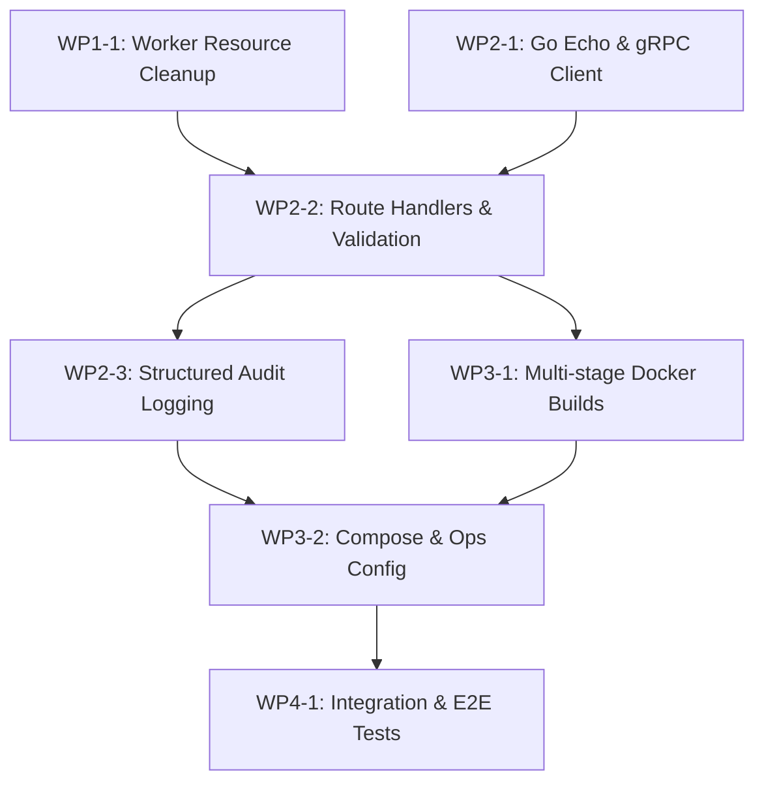

# Work Packages - Application to Blue Table Production Migration

## Project Goal
> Migrate the Application-to-BlueTable Intake POC into a simple, production-ready, and highly stable service. The system must prioritize processing accuracy, feature reliable operation without active maintenance, provide audit logging for compliance, and use clean resource boundaries, targeting deployment by July 31st.

---

## Work Package Overview

| WP | Name | Phase | Status | GitHub Issue / Link |
|---|---|---|---|---|
| 1 | Python gRPC Worker Service (Logic Engine) | Phase 1: Core Logic Engine | 🟢 Completed | [Issue #42](https://github.com/khemingkapat/app_to_bt/issues/42) |
| 2 | Go Echo Gateway (Routing & Validation) | Phase 2: Gateway & API | 🟡 In progress | [Issue #43](https://github.com/khemingkapat/app_to_bt/issues/43), [Issue #44](https://github.com/khemingkapat/app_to_bt/issues/44), [Issue #45](https://github.com/khemingkapat/app_to_bt/issues/45) |
| 3 | Production Infrastructure & Operations | Phase 3: Infrastructure | 🔴 Not started | [Issue #46](https://github.com/khemingkapat/app_to_bt/issues/46), [Issue #47](https://github.com/khemingkapat/app_to_bt/issues/47) |
| 4 | E2E Testing & Verification | Phase 4: Quality Assurance | 🔴 Not started | [Issue #49](https://github.com/khemingkapat/app_to_bt/issues/49) |

---

## Phase 1: Core Logic Engine ⚙️

### WP1-1: Resource Management & Cleaning [Issue #42](https://github.com/khemingkapat/app_to_bt/issues/42)
Implement memory-safe boundaries and automatic temporary file cleanup in the Python worker when processing large PDFs/DOCXs.
- Temp files deleted immediately after gRPC response
- CPU/Memory bounds configured for PyMuPDF processing

---

## Phase 2: Gateway & API 🌐

### WP2-1: Go Echo Scaffolding & Client Connection [Issue #43](https://github.com/khemingkapat/app_to_bt/issues/43)
Initialize the Go module, Echo server scaffolding, and set up the connection pool/client for the Python gRPC backend.
- Go module initialized with Echo server
- gRPC client connection with automatic reconnect/retry logic

### WP2-2: Route Handlers & Input Validation [Issue #44](https://github.com/khemingkapat/app_to_bt/issues/44)
Implement Echo endpoints mapping to worker RPCs with strict JSON schema validation to ensure input accuracy.
- `/process-pdf`, `/generate-pdf`, `/generate-docx`, `/stamp-signature` endpoints
- Strict schema validation rejecting malformed/incomplete input before worker calls

### WP2-3: Structured Audit Logging [Issue #45](https://github.com/khemingkapat/app_to_bt/issues/45)
Implement structured JSON audit logs in the Gateway recording every transaction state, timing, and success/failure status.
- JSON logger (e.g., zap or logrus) integrated into Echo middleware
- Ephemeral logs tracking payload hash and result status (excluding raw PII payload)

---

## Phase 3: Infrastructure 🐳

### WP3-1: Multi-stage Docker Builds [Issue #46](https://github.com/khemingkapat/app_to_bt/issues/46)
Create optimized, minimal Dockerfiles for both Go and Python services to reduce deployment size and vulnerabilities.
- Multi-stage Dockerfile for Go Gateway compiling static binary
- Lightweight Python worker Dockerfile with pip/uv dependencies frozen

### WP3-2: Docker Compose & Operational Config [Issue #47](https://github.com/khemingkapat/app_to_bt/issues/47)
Orchestrate local services with Docker Compose including memory/CPU constraints, health checks, and restart policies.
- `docker-compose.yml` with defined resource limits
- Automatic service health monitoring and self-healing restarts

---

## Phase 4: Quality Assurance 🧪

### WP4-1: Integration & End-to-End Tests [Issue #49](https://github.com/khemingkapat/app_to_bt/issues/49)
Develop a automated integration test suite that tests the flow from Go REST endpoints through the gRPC channel to the Python engine.
- Automated API regression tests
- Error case assertions (e.g. gRPC service down handler)

---

## Dependency Graph

