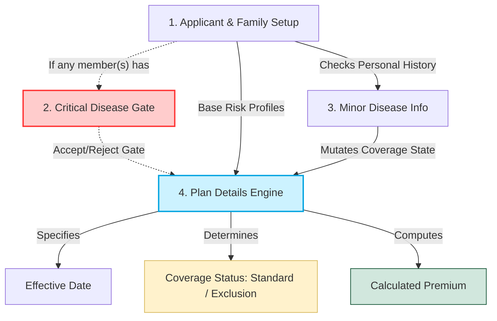

# Definition

E-Form will be my attempt to DECONSTRUCT and RECONSTRUCT how we need to answer the application form based on

1. User Experience
2. Data Integrity
3. Compliance and Legal Issue

but before we can do that we need to analyze what is happening with current form.

# Sections Dependencies

from the diagram, we could see that the outer one, with no **in-degree** and **out-degree** are `Personal Info`, `Critical Disease*` and `Plan*`

> I put asterisk on both `Critical Disease` and `Plan` since it is like it doesn't need info to be determine, but if info is provided, it would change it but we could estimate it.

# Plan

on the higher level, we would try to deconstruct each section of the form that doesn't really depend on each other, and we would make the form focused on more about the user experience.

Here is the high-level roadmap of how this deconstruction shapes our new user experience:

## Screen 1: The Hard-No Health Gate

* **The Goal:** A quick, upfront triage process that serves as the primary barrier before any sensitive personal variables are gathered.

* **The UX Flow:** The user screens the entire family composition against a highly policy-driven, specific checklist of automatic-decline health conditions.

* **The Logic:** If any member flags a condition, the journey finishes immediately with a transparent, honest explanation. This stops users from wasting time filling out an entire form only to face a guaranteed rejection later.

## Screen 2: Plan Sandbox & Premium Engine

* **The Goal:** An interactive simulation environment where a user handles plan selection and premium calculations easily.

* **The UX Flow:** The user inputs a simple family baseline (approximate ages and member counts).

* **The Logic:** The interface instantly shows a live, side-by-side comparison matrix across plan tiers and deductible options. Once a plan is selected, the premium calculation is locked down, allowing the user to buy into the choice before giving up complex identity data.

## Screen 3: Progressive Personal Info Blocks & ID Assisted Intake

* **The Goal:** A dynamic, adaptive completion layout built directly around the choices made in Screen 2.

* **The UX Flow:** The application renders identity panels only for the members included in the plan selection.

* **The Logic:** For adult profiles, the form provides an optional National ID upload bucket to pre-fill Name, DOB, and Address. Pre-filled data is highlighted side-by-side with original fields so a human-in-the-loop can quickly review and modify typos. Child profiles remain as clean, simple manual fields to ensure data structure safety. Non-critical minor health histories are collected last, feeding directly into the plan's final coverage status without breaking the onboarding process.

# Next Step

Once the user successfully completes and submits Screen 3, the consolidated data payload converges directly into our back-office admin system to fulfill our core operations:

## 1. BlueTable Row Generation

* **The Goal:** Convert the structured family payload into an immediate financial tracking record.

* **The Workflow:** The system flattens the nested data tree (including the locked premium, effective date, coverage status, and family identities) into a standardized, clean row layout. This row maps directly to our master spreadsheet template, allowing for an effortless copy-paste insertion into the BlueTable tracker without manual entry errors.

## 2. Original PDF Template Inversion

* **The Goal:** Reconstruct the finalized parameters back onto the legal document canvas.

* **The Workflow:** The backend script reads our spatial coordinate map layout to align the verified text fields and checkmark variables. It neatly stamps these parameters directly onto the original, un-flattened `OriginalApplication.pdf` template. This outputs a pristine, legally compliant document that perfectly reflects the automated digital intake journey, ready for final signature routing.
