# ✍️ Signature Gateway — Ephemeral Customer E-Signing Portal

This repository contains the **Signature Gateway** implementation: a database-free, compliance-first, and fully stateless portal designed to bridge the gap between pre-filled application forms and official signatures.

By integrating with the core `app-to-bt` (Application-to-BlueTable) processing pipeline, it lets Sales Representatives generate secure, single-use, timed signing links, check customer identity, capture digital signatures, and download finalized files.

---

## 🔄 High-Level Workflow

```mermaid
sequenceDiagram
    autonumber
    actor Rep as Sales Representative
    actor Cust as Customer
    participant Vault as In-Memory Vault
    participant Gateway as Signature Gateway App

    Rep->>Gateway: Upload pre-filled AcroForm PDF
    Note over Gateway: Match ID against templates & mappings
    Gateway->>Rep: Display customer summary & "Generate Link" button
    Rep->>Gateway: Click "Generate Secure Link"
    Note over Gateway: Create secure token & entry in memory
    Gateway->>Rep: Show copyable link (?token=...)
    Rep->>Cust: Send link (via Email/SMS/Chat)
    
    rect rgb(20, 25, 45)
        Note over Cust, Gateway: Mobile Customer Signing Flow
        Cust->>Gateway: Open link (?token=...)
        Gateway->>Cust: Challenge with identity check (ID/Passport gate)
        Cust->>Gateway: Enter ID number
        Note over Gateway: Normalized gate verification check
        Gateway->>Vault: Match ID & delete raw ID value (compliance drop)
        Gateway->>Cust: Show read-only summary + Touch-friendly canvas
        Cust->>Gateway: Sign & submit signature
        Note over Gateway: Stamp signature on PDF (PyMuPDF) & Fill DOCX
        Gateway->>Vault: Store generated bytes & flip status to "signed"
    end

    rect rgb(30, 35, 55)
        Note over Rep, Gateway: Sales Rep Portal Polling
        Gateway->>Rep: Detect status flip to "signed" (polling)
        Gateway->>Rep: Fire browser notification + render download buttons
        Rep->>Gateway: Download Signed PDF & BlueTable DOCX
        Rep->>Gateway: Click "Clear Transaction & PII"
        Note over Gateway: Purge document bytes & token from memory
    end
```



---

## 🔒 Compliance & Statelessness Controls

The architecture is explicitly designed around **zero long-term retention of raw customer PII**:

* **In-Memory Storage Only:** The `transaction_vault` lives exclusively in the Python server process memory. No customer name, ID number, signature canvas, or generated document bytes are ever written to disk.
* **Immediate ID Shredding:** The moment the customer's identity matches the gate check, the raw `identity_id` value is deleted from memory. It is not stored in the vault anymore.
* **15-Minute TTL Expiry:** Every token has a 15-minute Time-To-Live (TTL) duration. When the TTL expires, the vault entry is automatically purged and destroyed.
* **Manual Purge Callback:** Once the Sales Rep downloads the completed files, they can click a compliance purge button to immediately clear all bytes and metadata from memory.

---

## 🚀 Getting Started

This project is packaged with **Nix** and **uv** to ensure isolated, reproducible, and zero-configuration setups.

### 1. Start the Nix Development Shell
Enter the Nix shell to auto-load Python 3.11, `uv`, and required system libraries:
```bash
nix develop
```

### 2. Install Dependencies
Synchronize dependencies (including the sibling `app-to-bt` path dependency in editable mode):
```bash
uv sync
```

### 3. Launch the Streamlit Portal
Start the portal:
```bash
uv run streamlit run app.py
```

### 4. Run Integration Tests
Run unit tests for the vault and compliance gate:
```bash
uv run pytest
```

---

## 📂 File Architecture

* [app.py](file:///home/khemi/workspace/signature_gateway/app.py) — The main Streamlit entrypoint routing to the Rep Portal or Customer View.
* [vault.py](file:///home/khemi/workspace/signature_gateway/vault.py) — Thread-safe in-memory vault logic, ID normalization, and metadata/PII extraction.
* [tests/test_vault.py](file:///home/khemi/workspace/signature_gateway/tests/test_vault.py) — Automated test suite verifying compliance gates, TTL, and status changes.
* [flake.nix](file:///home/khemi/workspace/signature_gateway/flake.nix) — Nix environment declaration pinning package dependencies.
* [scripts/sync_templates.sh](file:///home/khemi/workspace/signature_gateway/scripts/sync_templates.sh) — A script to manually copy over templates, registries, and caches from `app_to_bt`.

---

## 🔄 Manually Syncing Registry & Config Templates

Since the Signature Gateway is a separated project that does not share active symlinks with `app_to_bt`, the mapping configurations and templates are fully self-contained. 

To pull updated mappings, templates, or configurations from the main `app_to_bt` workspace, run:
```bash
./scripts/sync_templates.sh
```
This utility copies files from the sibling `../app_to_bt` directory into local `outputs/`, `config/`, and `resources/` directories inside `signature_gateway`.

